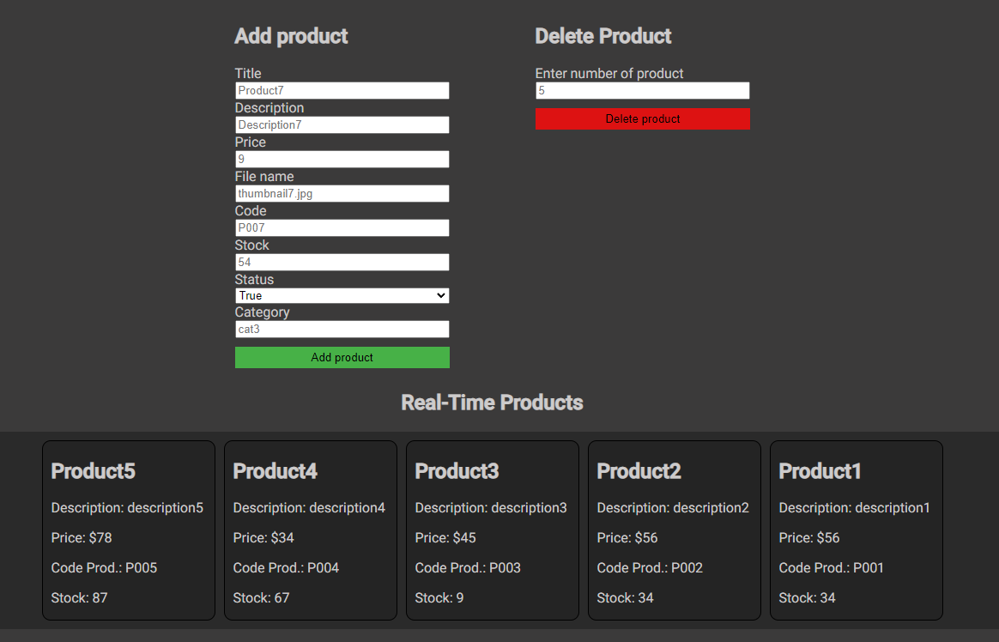

#Aspectos a incluir

1- Configurar el servidor para integrar el motor de plantillas Handlebars e
   instalar un servidor de socket.io al mismo. ✅

2- Crear una vista “home.handlebars” la cual contenga una lista de todos 
   los productos agregados hasta el momento.✅

3- Además, crear una vista “realTimeProducts.handlebars”, la cual vivirá
   en el endpoint “/realtimeproducts” en nuestro views router, ésta contendrá
  la misma lista de productos, sin embargo, ésta trabajará con websockets.✅

    - Al trabajar con websockets, cada vez que creemos un producto nuevo,
      o bien cada vez que eliminemos un producto, se debe
      actualizar automáticamente en dicha vista la lista.✅

    - Ya que la conexión entre una consulta HTTP y websocket no está 
      contemplada dentro de la clase. Se recomienda que, para la creación
      y eliminación de un producto,se cree un formulario simple en la vista
      realTimeProducts.handlebars. 
      Para que el contenido se envíe desde websockets y no HTTP.✅

      Sin embargo, esta no es la mejor solución, leer el siguiente punto.

    -Si se desea hacer la conexión de socket emits con HTTP, deberás buscar
     la forma de utilizar el servidor io de Sockets dentro de la petición POST.
     ¿Cómo utilizarás un emit dentro del POST?✅

#DEPENDENCIES
    - express "^4.18.2"
    - express-handlebars: ^7.1.2"
    - socket.io: ^4.7.4
  
